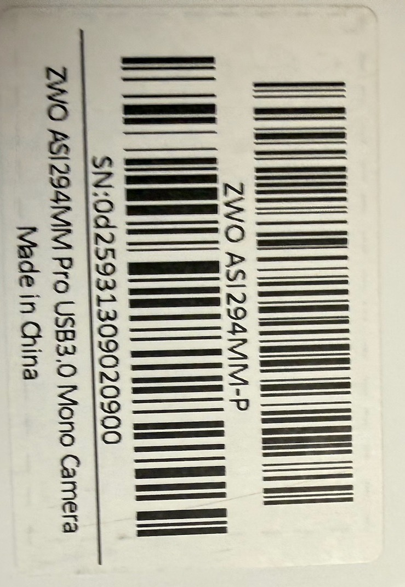
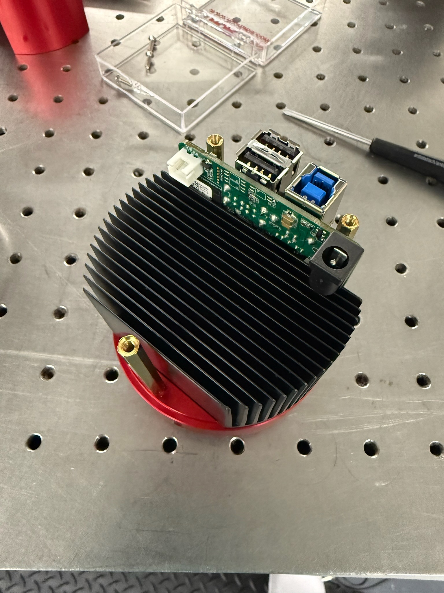
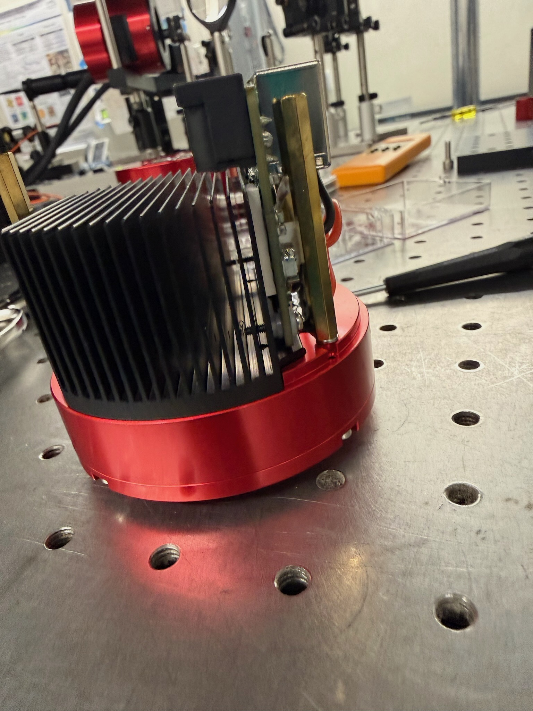
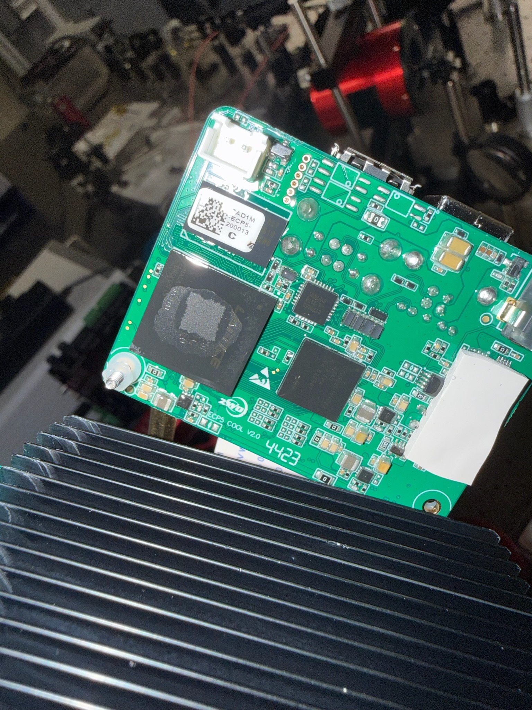
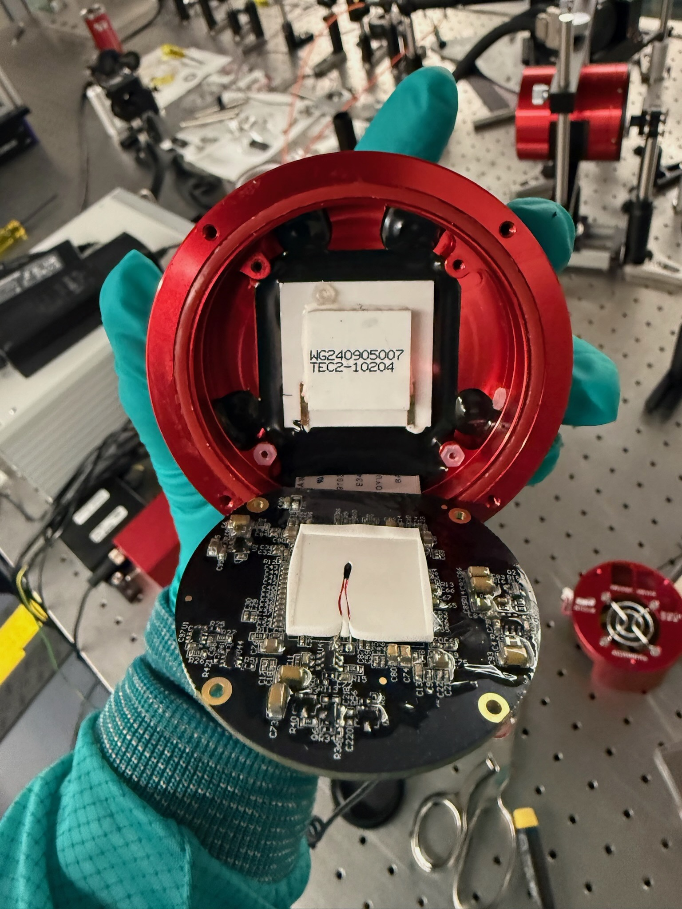
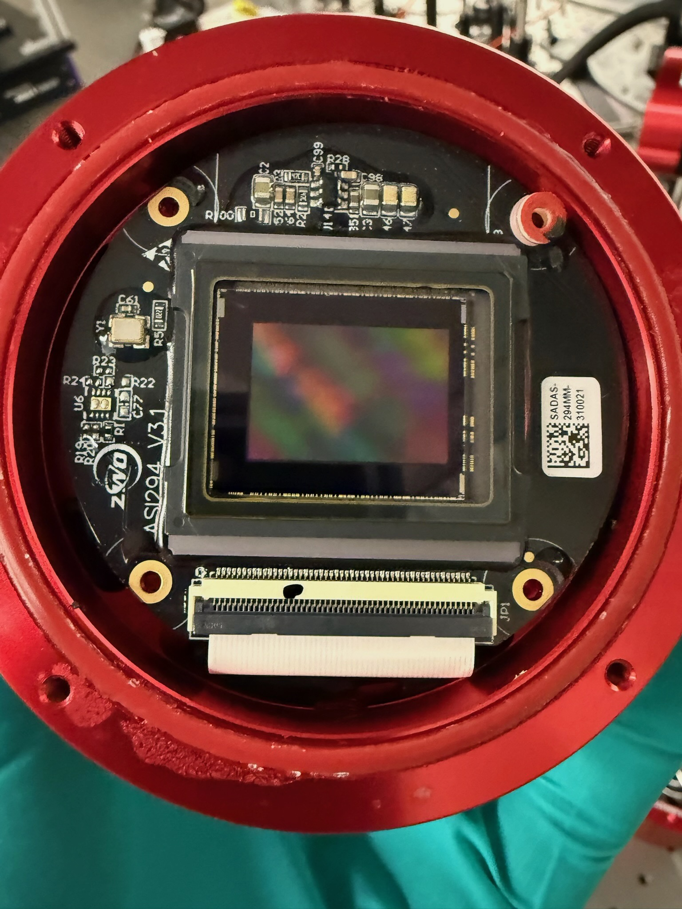
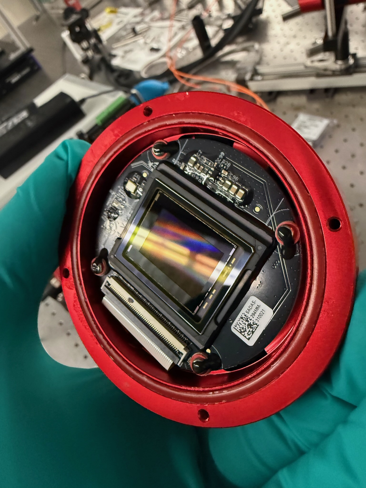

# Teardown: ZWO ASI 294 Pro

**Subject:** ZWO ASI 294 MC/MM Pro
**Warning:** *A grounding strap was worn at all times.*

There is conflicting information about whether the ASI 294 is an IMX294 or IMX492 sensor. This teardown is an initial attempt to locate the part number on the chip.

A secondary purpose of this post is to see if LLM/GAI tools can be used to speed up documentation generation.

## 2. Shell Removal

---

## 3. Main PCB
Board contains a FPGA and pads heat sink the FPGA to side of the main radiative heatsink

---

## 4. Cooling System

---

## 5. Sensor 
Close inspection does not reveal any identifying marks on the sensor. I expect it is under the chip and we will have to desolder.

---

LLM disclosure: [Google Gemini Licensed to University of Arizona](https://uarizona.service-now.com/sp?id=kb_article_view&sysparm_article=KB0012513) was used to generate a template of this blog post.

The prompts used were: 

>  "please draft a markdown file that is a blog post of tearing down an astronomical camera CMOS camera (ASI 294 Pro) with photos, i will fill in the photo filenames and any technical details "

This was run on fast and returned a wall of text that was not in markdown, not useful. 

I switched the mode to "Pro" and re-ran the prompt. This generated a wordy document that was in markdown format and useable but still had too many descriptive adjectives and assumed i wanted to describe the technical datasheets of each part.
additional prompts:

> "make it terser"
> "remove adjectives and quantitative statements"

I took this draft and filled in the images and rewording text to match reality.

final prompt:
> here is my draft, please check for typos 

this was useful, Gemini noted paths that some of the paths were relative and some were fixed because of how i pasted into VS Code and a grammatical error (worn vs warn).

to figure out how long it took I asked Gemini for the timeline of those prompts and was met with the interesting response "I do not have access to the specific timestamps of when you entered your previous prompts in this session. I can only see the conversation history as a continuous flow of text."

Based on my local file system timestamps the process of generating the document and conversing with Gemini took about 21 minutes.